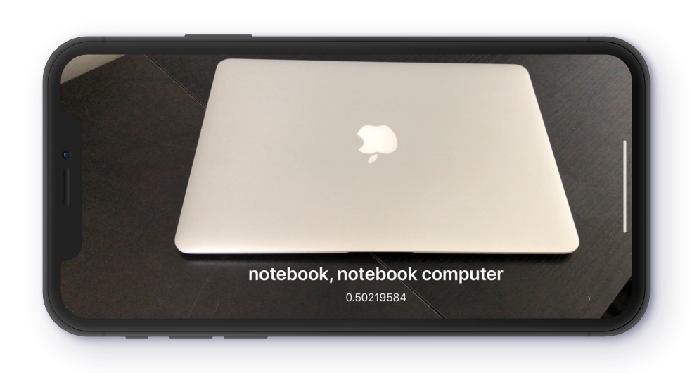
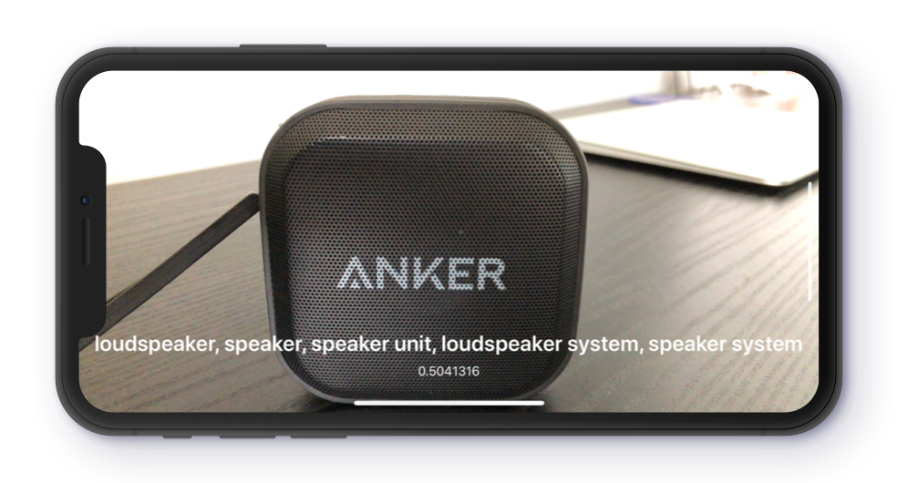
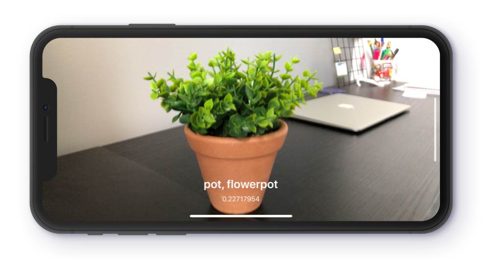

# SmartCamera-CoreML
App concept using CoreML (Machine Learning) that are able to detect the dominant objects present around you from a set of 1000 categories such as trees, animals, food, vehicles, people, and more. 

